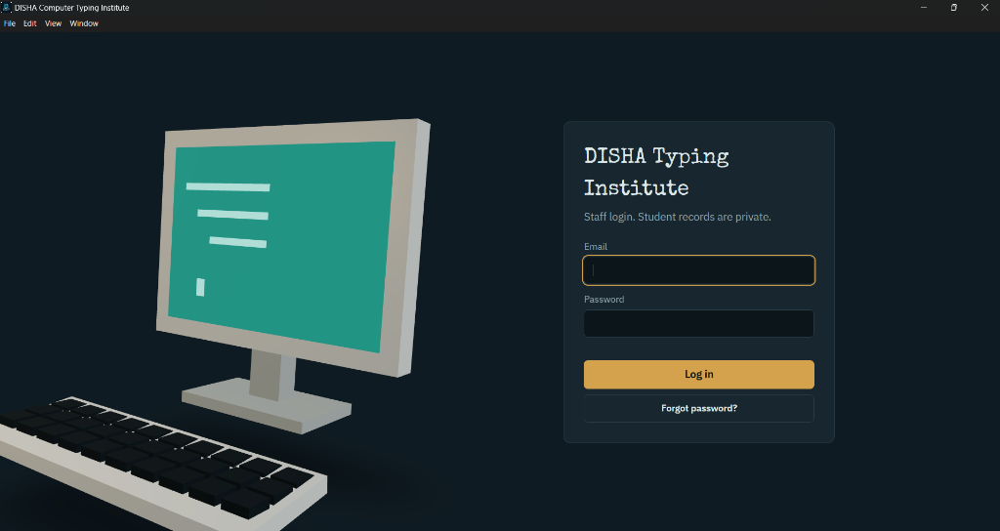
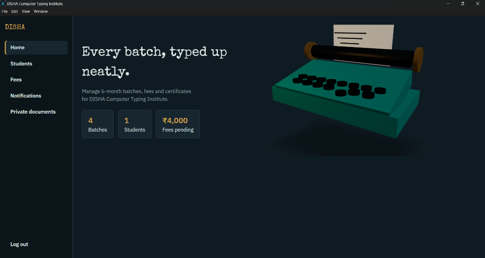
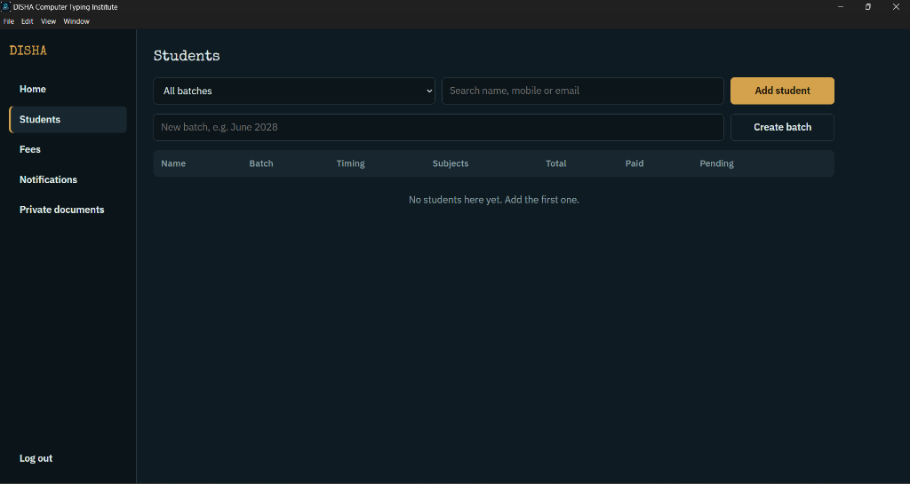
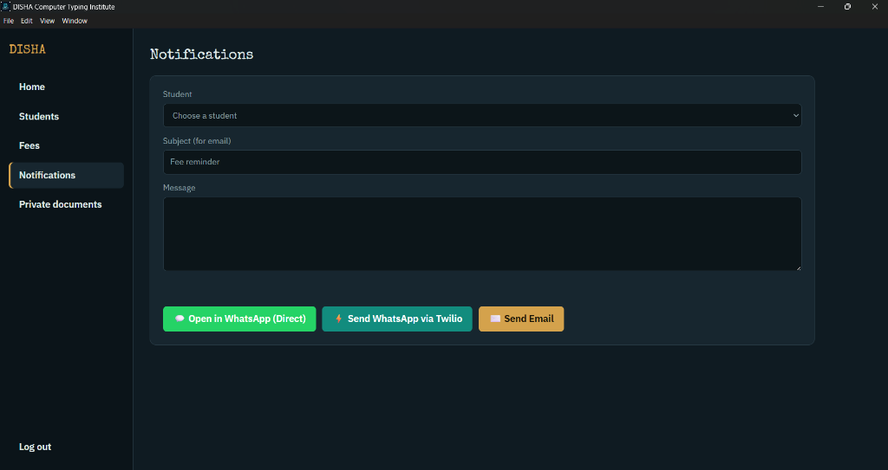
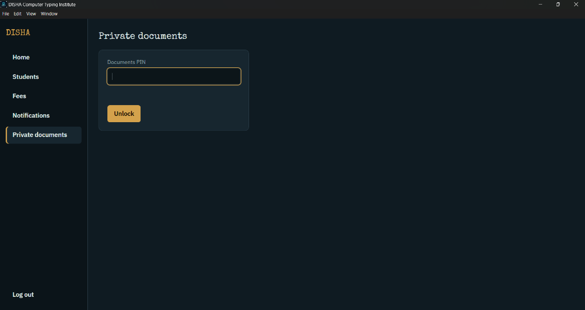

# DISHA Computer Typing Institute – Desktop Software Application 🖥️⌨️

> Standalone Windows Desktop Application built for **DISHA Computer Typing Institute**. Features an interactive 3D user interface, batch & student fee management, multi-channel WhatsApp & Email notifications, and PIN-protected private document storage.

---

## 📸 Application Screenshots

### 🔑 1. Staff Login Screen


---

### 🏠 2. Institute Dashboard


---

### 👥 3. Student & Batch Management


---

### 💬 4. WhatsApp & Email Notifications


---

### 🔐 5. Secure Private Documents Vault


---

## ✨ Application Features

* **🎨 Interactive 3D Interface**: Built with Three.js rendering retro computer hardware & typewriter 3D canvases.
* **🎓 Student & Batch Management**: Manage 6-month typing batches (English/Marathi 30, 40, 50 WPM), track practice timings, and calculate fees automatically.
* **📱 WhatsApp & Email Notifications**:
  * **1-Click Direct WhatsApp (`wa.me`)**: Open WhatsApp Desktop/Web pre-filled with fee reminders directly from institute phone (`+918421535753`).
  * **Twilio WhatsApp API**: Automated backend WhatsApp messaging.
  * **SMTP Email**: Send email reminders & password reset links via Gmail SMTP.
* **🔒 Private Documents Vault**: Encrypted storage for student exam results & government certificates, secured behind a 6-digit Security PIN.
* **🖥️ Standalone Windows Desktop Executable**: Runs as a desktop software app with built-in runtime — no local dependencies required on target PCs.

---

## 📦 How to Download & Install

1. Download the Windows installer: `DISHA Typing Institute Setup 1.0.0.exe`
2. Double-click the installer to install the software on your Windows PC.
3. Open **DISHA Typing Institute** from your Desktop or Start Menu.

---

## 🛠️ Building the Desktop Installer (.exe)

To build the standalone Windows application installer from source:

```bash
# 1. Install dependencies
npm run install:all

# 2. Build Windows Installer (.exe)
npm run build
```

The generated installer will be output to:
`dist-electron/DISHA Typing Institute Setup 1.0.0.exe`

---

## 📜 License
Copyright © 2026 DISHA Computer Typing Institute. All rights reserved.
